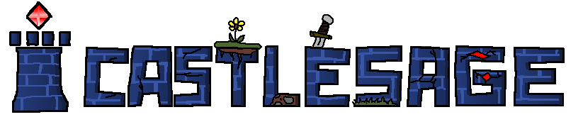
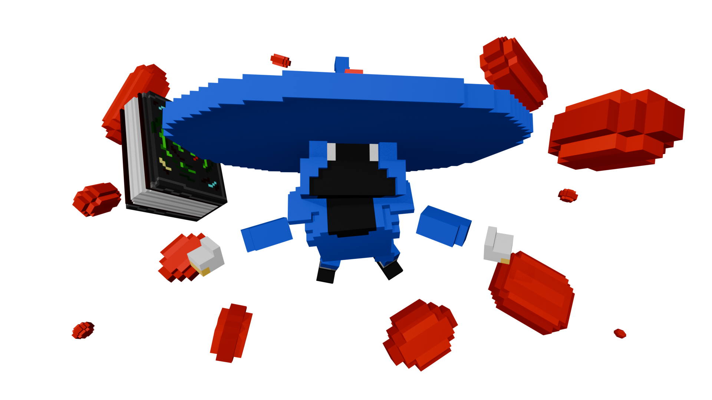
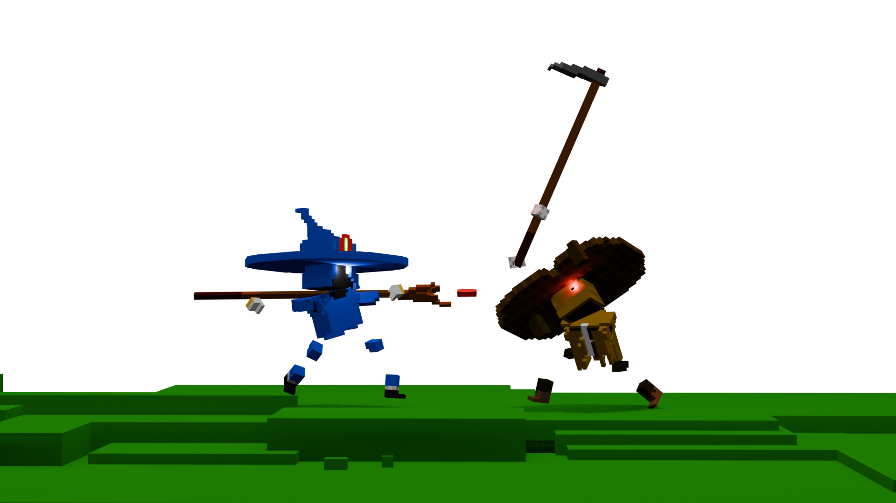

# 

Welcome to Castlesage™, a voxel MOBA set in a medieval world. Gather resources, fortify your castle, and prepare for the endgame, where raw power alone is never enough.

Choose your playstyle and shape the battlefield in real time. Raise towers, reinforce barricades, and construct workshops to fuel a war that never stops evolving.

When the surface is no longer enough, dig deep beneath it. Mine precious ores, push into the underground, and brave the depths near the Abyss.

The game is currently in **Pre-Alpha**. Access is available through playtesting sessions organized on our Discord server.

## Links
### Social Media
- **[Discord](https://discord.gg/WvpsSDzvGf)**
- **[Itch.io](https://acanixz.itch.io/castlesage/devlog)**
- **[Twitter/X](https://x.com/acanixz)**
- **[Youtube (Acanixz)](https://www.youtube.com/@Acanixz)**
### Source Code (Currently Private)
- **[Project Repository](https://github.com/Acanixz/Castlesage)**
- **[Wiki](https://github.com/Acanixz/Castlesage/wiki)**